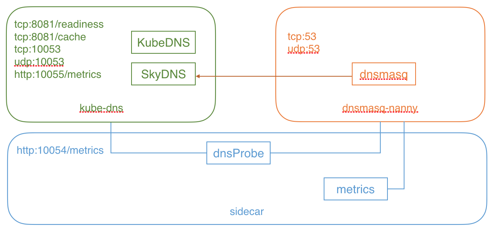

# DNS

DNS 是 Kubernetes 的核心功能之一，通过 kube-dns 或 CoreDNS 作为集群的必备扩展来提供命名服务。

## 支持的 DNS 格式

- Service
  - A record：生成 `my-svc.my-namespace.svc.cluster.local`，解析 IP 分为两种情况
    - 普通 Service 解析为 Cluster IP
    - Headless Service 解析为指定的 Pod IP 列表
  - SRV record：生成 `_my-port-name._my-port-protocol.my-svc.my-namespace.svc.cluster.local`
- Pod
  - A record：`pod-ip-address.my-namespace.pod.cluster.local`
  - 指定 hostname 和 subdomain：`hostname.custom-subdomain.default.svc.cluster.local`，如下所示

```yaml
apiVersion: v1
kind: Pod
metadata:
  name: busybox2
  labels:
    name: busybox
spec:
  hostname: busybox-2
  subdomain: default-subdomain
  containers:
  - image: busybox
    command:
      - sleep
      - "3600"
    name: busybox
```


## 支持配置私有 DNS 服务器和上游 DNS 服务器

从 Kubernetes 1.6 开始，可以通过为 kube-dns 提供 ConfigMap 来实现对存根域以及上游名称服务器的自定义指定。例如，下面的配置插入了一个单独的私有根 DNS 服务器和两个上游 DNS 服务器。

```yaml
apiVersion: v1
kind: ConfigMap
metadata:
  name: kube-dns
  namespace: kube-system
data:
  stubDomains: |
    {“acme.local”: [“1.2.3.4”]}
  upstreamNameservers: |
    [“8.8.8.8”, “8.8.4.4”]
```
使用上述特定配置，查询请求首先会被发送到 kube-dns 的 DNS 缓存层 (Dnsmasq 服务器)。Dnsmasq 服务器会先检查请求的后缀，带有集群后缀（例如：”.cluster.local”）的请求会被发往 kube-dns，拥有存根域后缀的名称（例如：”.acme.local”）将会被发送到配置的私有 DNS 服务器[“1.2.3.4”]。最后，不满足任何这些后缀的请求将会被发送到上游 DNS [“8.8.8.8”, “8.8.4.4”] 里。


## 启动 kube-dns 示例

一般通过扩展的方式部署 DNS 服务，如把 [kube-dns.yaml](https://kubernetes.feisky.xyz/manifests/kubedns/kube-dns.yaml) 放到 Master 节点的 `/etc/kubernetes/addons` 目录中。当然也可以手动部署：

```sh
kubectl apply -f https://kubernetes.feisky.xyz/manifests/kubedns/kube-dns.yaml
```


这会在 Kubernetes 中启动一个包含三个容器的 Pod，运行着 DNS 相关的三个服务：

```sh
# kube-dns container
kube-dns --domain=cluster.local. --dns-port=10053 --config-dir=/kube-dns-config --v=2

# dnsmasq container
dnsmasq-nanny -v=2 -logtostderr -configDir=/etc/k8s/dns/dnsmasq-nanny -restartDnsmasq=true -- -k --cache-size=1000 --log-facility=- --server=127.0.0.1#10053

# sidecar container
sidecar --v=2 --logtostderr --probe=kubedns,127.0.0.1:10053,kubernetes.default.svc.cluster.local.,5,A --probe=dnsmasq,127.0.0.1:53,kubernetes.default.svc.cluster.local.,5,A
```

Kubernetes v1.10 也支持 Beta 版的 CoreDNS，其性能较 kube-dns 更好。可以以扩展方式部署，如把 [coredns.yaml](https://kubernetes.feisky.xyz/manifests/kubedns/coredns.yaml) 放到 Master 节点的 `/etc/kubernetes/addons` 目录中。当然也可以手动部署：

```sh
kubectl apply -f https://kubernetes.feisky.xyz/manifests/kubedns/coredns.yaml
```

## kube-dns 工作原理

如下图所示，kube-dns 由三个容器构成：

- kube-dns：DNS 服务的核心组件，主要由 KubeDNS 和 SkyDNS 组成
  - KubeDNS 负责监听 Service 和 Endpoint 的变化情况，并将相关的信息更新到 SkyDNS 中
  - SkyDNS 负责 DNS 解析，监听在 10053 端口 (tcp/udp)，同时也监听在 10055 端口提供 metrics
  - kube-dns 还监听了 8081 端口，以供健康检查使用
- dnsmasq-nanny：负责启动 dnsmasq，并在配置发生变化时重启 dnsmasq
  - dnsmasq 的 upstream 为 SkyDNS，即集群内部的 DNS 解析由 SkyDNS 负责
- sidecar：负责健康检查和提供 DNS metrics（监听在 10054 端口）



### 源码简介

kube-dns 的代码已经从 kubernetes 里面分离出来，放到了 <https://github.com/kubernetes/dns>。

kube-dns、dnsmasq-nanny 和 sidecar 的代码均是从 `cmd/<cmd-name>/main.go` 开始，并分别调用 `pkg/dns`、`pkg/dnsmasq` 和 `pkg/sidecar` 完成相应的功能。而最核心的 DNS 解析则是直接引用了 `github.com/skynetservices/skydns/server` 的代码，具体实现见 [skynetservices/skydns](https://github.com/skynetservices/skydns/tree/master/server)。

## CoreDNS

从 v1.11 开始还可以使用 [CoreDNS](https://coredns.io/) 来提供命名服务，其效率更高，资源占用率更小。

可以使用替换 kube-dns 的方式将其部署到 Kubernetes 集群中：

```sh
$ git clone https://github.com/coredns/deployment
$ cd deployment
$ ./deploy.sh | kubectl apply -f -
$ kubectl delete --namespace=kube-system deployment kube-dns
```

## 参考文档

- [dns-pod-service 介绍](https://kubernetes.io/docs/concepts/services-networking/dns-pod-service/)
- [coredns/coredns](https://github.com/coredns/coredns)
