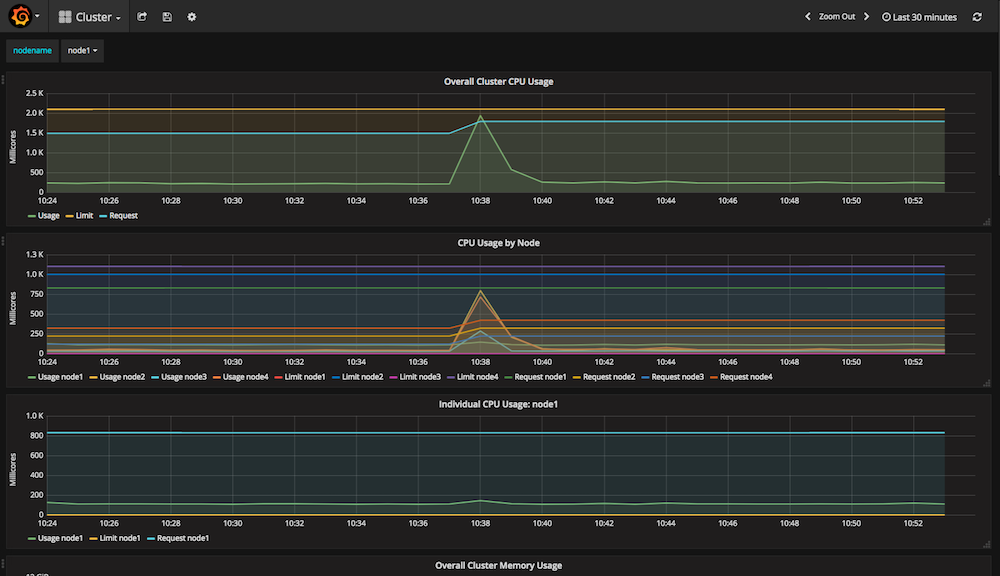

# Heapster

Kubelet内置的cAdvisor只提供了单机的容器资源占用情况，而[Heapster](https://github.com/kubernetes/heapster)则提供了整个集群的资源监控，并支持持久化数据存储到InfluxDB、Google Cloud Monitoring或者[其他的存储后端](https://github.com/kubernetes/heapster)。

Heapster首先从Kubernetes apiserver查询所有Node的信息，然后再从kubelet提供的API采集节点和容器的资源占用，同时在`/metrics` API提供了Prometheus格式的数据。Heapster采集到的数据可以推送到各种持久化的后端存储中，如InfluxDB、Google Cloud Monitoring、OpenTSDB等。


## 部署Heapster、InfluxDB和Grafana

```sh
git clone https://github.com/kubernetes/heapster
cd heapster

kubectl create -f deploy/kube-config/influxdb/
kubectl create -f deploy/kube-config/rbac/heapster-rbac.yaml
```

稍等一会，就可以通过`kubectl cluster-info`看到这些服务：

```sh
$ kubectl cluster-info
Kubernetes master is running at https://10.0.4.3:6443
Heapster is running at https://10.0.4.3:6443/api/v1/namespaces/kube-system/services/heapster/proxy
KubeDNS is running at https://10.0.4.3:6443/api/v1/namespaces/kube-system/services/kube-dns/proxy
monitoring-grafana is running at https://10.0.4.3:6443/api/v1/namespaces/kube-system/services/monitoring-grafana/proxy
monitoring-influxdb is running at https://10.0.4.3:6443/api/v1/namespaces/kube-system/services/monitoring-influxdb/proxy
```

注意在访问这些服务时，需要先在浏览器中导入apiserver证书才可以认证。为了简化访问过程，也可以使用kubectl代理来访问（不需要导入证书）：

```sh
# 启动代理
kubectl proxy --address='0.0.0.0' --port=8080 --accept-hosts='^*$' &
```

然后打开`http://<master-ip>:8080/api/v1/proxy/namespaces/kube-system/services/monitoring-grafana`就可以访问Grafana。



## 参考文档

- [Kubernetes Heapster](https://github.com/kubernetes/heapster)
