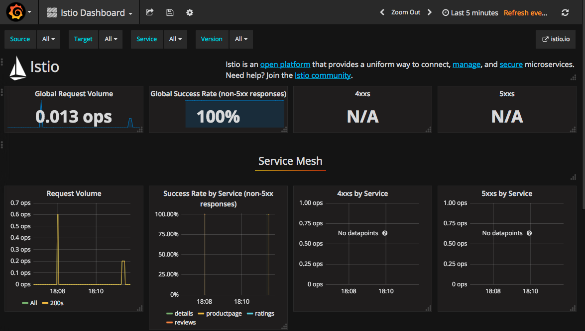
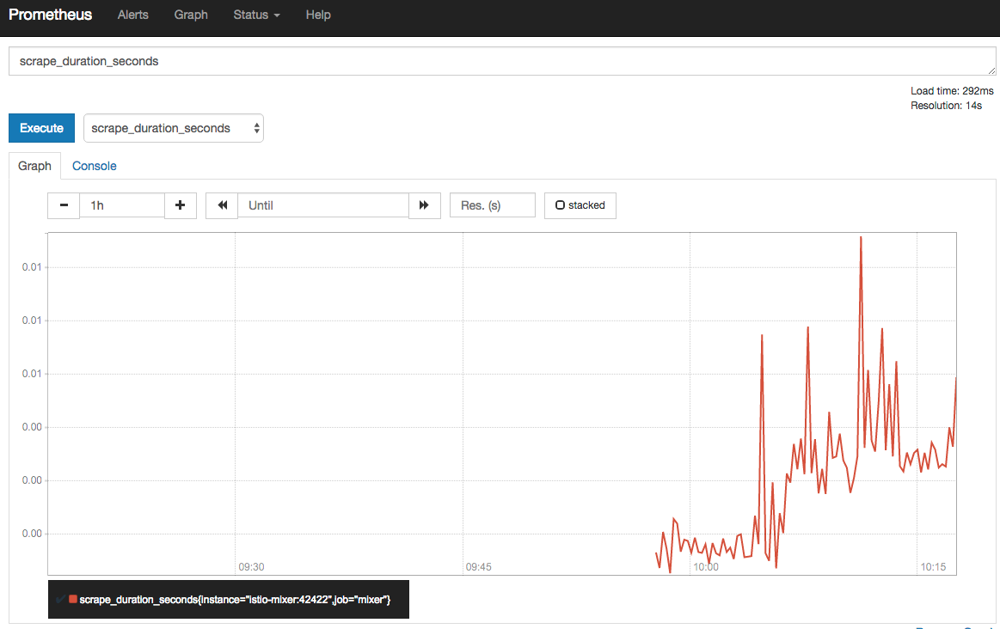

# Istio 安装部署

在安装 Istio 之前要确保 Kubernetes 集群（仅支持 v1.7.3 及以后版本）已部署并配置好本地的 kubectl 客户端。比如，使用 minikube：

```sh
minikube start \
  --extra-config=controller-manager.ClusterSigningCertFile="/var/lib/localkube/certs/ca.crt" \
  --extra-config=controller-manager.ClusterSigningKeyFile="/var/lib/localkube/certs/ca.key" \
  --extra-config=apiserver.Admission.PluginNames=NamespaceLifecycle,LimitRanger,ServiceAccount,PersistentVolumeLabel,DefaultStorageClass,DefaultTolerationSeconds,MutatingAdmissionWebhook,ValidatingAdmissionWebhook,ResourceQuota \
  --kubernetes-version=v1.9.0
```

## 下载 Istio

```sh
curl -L https://git.io/getLatestIstio | sh -
sudo apt-get install -y jq
ISTIO_VERSION=$(curl -L -s https://api.github.com/repos/istio/istio/releases/latest | jq -r .tag_name)
cd istio-${ISTIO_VERSION}
cp bin/istioctl /usr/local/bin
```

## 部署 Istio 服务

初始化 Helm Tiller：

```sh
kubectl create -f install/kubernetes/helm/helm-service-account.yaml
helm init --service-account tiller
```

两种方式（选择其一执行）

- 开启自动 sidecar 注入

```sh
helm install install/kubernetes/helm/istio --name istio --namespace istio-system --set tracing.enabled=true --set servicegraph.enabled=true --set prometheus.enabled=true --set grafana.enabled=true
```

- 不开启自动 sidecar 注入

```sh
helm install install/kubernetes/helm/istio --name istio --namespace istio-system --set sidecarInjectorWebhook.enabled=false --set tracing.enabled=true --set servicegraph.enabled=true --set prometheus.enabled=true --set grafana.enabled=true
```

部署完成后，可以检查 isotio-system namespace 中的服务是否正常运行：

```sh
$ kubectl -n istio-system get pod
NAME                                       READY     STATUS      RESTARTS   AGE
istio-citadel-7bdc7775c7-mcxcc             1/1       Running     0          2m
istio-egressgateway-795fc9b47-r4m2r        1/1       Running     0          2m
istio-ingress-84659cf44c-gwmrs             1/1       Running     0          2m
istio-ingressgateway-7d89dbf85f-czz4p      1/1       Running     0          2m
istio-mixer-post-install-ltmk2             0/1       Completed   0          1m
istio-pilot-66f4dd866c-7nnrn               2/2       Running     0          2m
istio-policy-76c8896799-rdppv              2/2       Running     0          2m
istio-sidecar-injector-645c89bc64-csq8r    1/1       Running     0          2m
istio-statsd-prom-bridge-949999c4c-2gvb6   1/1       Running     0          2m
istio-telemetry-6554768879-n5cc2           2/2       Running     0          2m
prometheus-86cb6dd77c-mgs7v                1/1       Running     0          2m

$ kubectl -n istio-system get service
NAME                       TYPE           CLUSTER-IP     EXTERNAL-IP   PORT(S)                                                               AGE
istio-citadel              ClusterIP      10.0.175.222   <none>        8060/TCP,9093/TCP                                                     3m
istio-egressgateway        ClusterIP      10.0.24.39     <none>        80/TCP,443/TCP                                                        3m
istio-ingress              LoadBalancer   10.0.2.194     13.76.0.92    80:32000/TCP,443:31892/TCP                                            3m
istio-ingressgateway       LoadBalancer   10.0.148.253   13.76.6.179   80:31380/TCP,443:31390/TCP,31400:31400/TCP                            3m
istio-pilot                ClusterIP      10.0.125.168   <none>        15003/TCP,15005/TCP,15007/TCP,15010/TCP,15011/TCP,8080/TCP,9093/TCP   3m
istio-policy               ClusterIP      10.0.57.91     <none>        9091/TCP,15004/TCP,9093/TCP                                           3m
istio-sidecar-injector     ClusterIP      10.0.24.240    <none>        443/TCP                                                               3m
istio-statsd-prom-bridge   ClusterIP      10.0.115.60    <none>        9102/TCP,9125/UDP                                                     3m
istio-telemetry            ClusterIP      10.0.86.182    <none>        9091/TCP,15004/TCP,9093/TCP,42422/TCP                                 3m
prometheus                 ClusterIP      10.0.13.19     <none>        9090/TCP
```

### Mesh Expansion

Istio 还支持管理非 Kubernetes 管理的应用。此时，需要在应用所在的 VM 或者物理中部署 Istio，具体步骤请参考 <https://istio.io/docs/setup/kubernetes/mesh-expansion.html>。

部署好后，就可以向 Istio 注册应用，如

```sh
# istioctl register servicename machine-ip portname:port
istioctl -n onprem register mysql 1.2.3.4 3306
istioctl -n onprem register svc1 1.2.3.4 http:7000
```

## 部署示例应用

```sh
kubectl apply -f <(istioctl kube-inject -f samples/bookinfo/kube/bookinfo.yaml)
```

稍等一会，使用端口转发的方式访问 productpage 服务：

```sh
$ kubectl port-forward service/productpage :9080
Forwarding from 127.0.0.1:54198 -> 9080
Forwarding from [::1]:54198 -> 9080

# Open http://127.0.0.1:54198 in browser.
```

## Prometheus、Grafana 和 Zipkin

等所有 Pod 启动后，可以通过 NodePort、负载均衡服务的外网 IP 或者 `kubectl proxy` 来访问这些服务。比如通过 `kubectl proxy` 方式，先启动 kubectl proxy

```sh
$ kubectl proxy
Starting to serve on 127.0.0.1:8001
```

通过 `http://localhost:8001/api/v1/namespaces/istio-system/services/grafana:3000/proxy/` 访问 Grafana 服务



通过 `http://localhost:8001/api/v1/namespaces/istio-system/services/servicegraph:8088/proxy/` 访问 ServiceGraph 服务，展示服务之间调用关系图


- `/force/forcegraph.html` As explored above, this is an interactive [D3.js](https://d3js.org/) visualization.
- `/dotviz` is a static [Graphviz](https://www.graphviz.org/) visualization.
- `/dotgraph` provides a [DOT](https://en.wikipedia.org/wiki/DOT_(graph_description_language)) serialization.
- `/d3graph` provides a JSON serialization for D3 visualization.
- `/graph` provides a generic JSON serialization.

通过 `http://localhost:8001/api/v1/namespaces/istio-system/services/zipkin:9411/proxy/` 访问 Zipkin 跟踪页面


通过 `http://localhost:8001/api/v1/namespaces/istio-system/services/prometheus:9090/proxy/` 访问 Prometheus 页面


