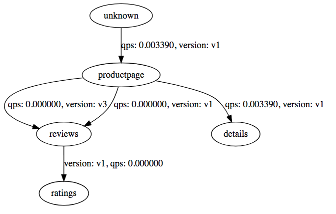

# Istio 安装部署

在安装 Istio 之前要确保 Kubernetes 集群（仅支持 v1.7.3 及以后版本）已部署并配置好本地的 kubectl 客户端。比如，使用 minikube：

```sh
  minikube start \
	--extra-config=controller-manager.ClusterSigningCertFile="/var/lib/localkube/certs/ca.crt" \
	--extra-config=controller-manager.ClusterSigningKeyFile="/var/lib/localkube/certs/ca.key" \
	--extra-config=apiserver.Admission.PluginNames=NamespaceLifecycle,LimitRanger,ServiceAccount,PersistentVolumeLabel,DefaultStorageClass,DefaultTolerationSeconds,MutatingAdmissionWebhook,ValidatingAdmissionWebhook,ResourceQuota \
	--kubernetes-version=v1.9.0
```

## 下载 Istio

```sh
curl -L https://git.io/getLatestIstio | sh -
ISTIO_VERSION=$(curl -L -s https://api.github.com/repos/istio/istio/releases/latest | jq -r .tag_name)
cd istio-${ISTIO_VERSION}
cp bin/istioctl /usr/local/bin
```

## 部署Istio服务

两种方式（选择其一执行）

- 禁止Auth：`kubectl apply -f install/kubernetes/istio.yaml`
- 启用Auth：`kubectl apply -f install/kubernetes/istio-auth.yaml`

部署完成后，可以检查 isotio-system namespace 中的服务是否正常运行：

```sh
$ kubectl -n istio-system get pod
NAME                                       READY     STATUS      RESTARTS   AGE
grafana-6b9f5db547-f8ng2                   1/1       Running     0          2d
istio-citadel-67498fd666-5tdgn             1/1       Running     0          2d
istio-ingress-6c59f8468b-9464d             1/1       Running     0          2d
istio-mixer-create-cr-dtz2s                0/1       Completed   0          2d
istio-pilot-66cfb869bd-rdx8m               2/2       Running     2          2d
istio-policy-685d7549bd-6sc9c              2/2       Running     0          2d
istio-statsd-prom-bridge-949999c4c-wkd4v   1/1       Running     0          2d
istio-telemetry-57c99b9557-vbscf           2/2       Running     0          2d
prometheus-6c54fc5cf-zvcrc                 1/1       Running     0          2d
servicegraph-747446b9cc-dr7rk              1/1       Running     0          2d
zipkin-5bb59f7586-trgkl                    1/1    部署   Running     0          2d

$ kubectl -n istio-system get service
NAME                       TYPE           CLUSTER-IP     EXTERNAL-IP     PORT(S)                                                               AGE
grafana                    ClusterIP      10.0.60.174    <none>          3000/TCP                                                              2d
istio-citadel              ClusterIP      10.0.3.199     <none>          8060/TCP,9093/TCP                                                     2d
istio-ingress              LoadBalancer   10.0.125.189   <pending>       80:32058/TCP,443:32009/TCP                                            2d
istio-pilot                ClusterIP      10.0.95.230    <none>          15003/TCP,15005/TCP,15007/TCP,15010/TCP,15011/TCP,8080/TCP,9093/TCP   2d
istio-policy               ClusterIP      10.0.1.55      <none>          9091/TCP,15004/TCP,9093/TCP                                           2d
istio-statsd-prom-bridge   ClusterIP      10.0.115.134   <none>          9102/TCP,9125/UDP                                                     2d
istio-telemetry            ClusterIP      10.0.223.173   <none>          9091/TCP,15004/TCP,9093/TCP,42422/TCP                                 2d
prometheus                 ClusterIP      10.0.202.218   <none>          9090/TCP                                                              2d
servicegraph               ClusterIP      10.0.186.106   <none>          8088/TCP                                                              2d
zipkin                     ClusterIP      10.0.18.244    <none>          9411/TCP                                                              2d
```

### Helm

除了上述方法，还可以使用 Helm 来部署 Istio：

```sh
kubectl create -f install/kubernetes/helm/helm-service-account.yaml
helm init --service-account tiller

helm install install/kubernetes/helm/istio --name istio
```

### Mesh Expansion

Istio 还支持管理非 Kubernetes 管理的应用。此时，需要在应用所在的 VM 或者物理中部署 Istio，具体步骤请参考 <https://istio.io/docs/setup/kubernetes/mesh-expansion.html>。

部署好后，就可以向 Istio 注册应用，如

```sh
# istioctl register servicename machine-ip portname:port
istioctl -n onprem register mysql 1.2.3.4 3306
istioctl -n onprem register svc1 1.2.3.4 http:7000
```

## 部署Prometheus、Grafana和Zipkin插件

```sh
$ kubectl apply -f install/kubernetes/addons/
service "grafana" created
deployment "grafana" created
serviceaccount "grafana" created
configmap "prometheus" created
service "prometheus" created
deployment "prometheus" created
serviceaccount "prometheus" created
clusterrole "prometheus" created
clusterrolebinding "prometheus" created
deployment "servicegraph" created
service "servicegraph" created
deployment "zipkin-to-stackdriver" created
service "zipkin-to-stackdriver" created
deployment "zipkin" created
service "zipkin" created
```

> 注意：上述步骤自动部署了 zipkin-to-stackdriver，如果不需要的话可以将其删除，如
>
> kubectl delete -f install/kubernetes/addons/zipkin-to-stackdriver.yaml

等一会所有Pod启动后，可以通过 NodePort、负载均衡服务的外网 IP 或者 `kubectl proxy` 来访问这些服务。比如通过`kubectl proxy` 方式，先启动 kubectl proxy

```sh
$ kubectl proxy
Starting to serve on 127.0.0.1:8001
```

通过`http://localhost:8001/api/v1/namespaces/istio-system/services/grafana:3000/proxy/`访问Grafana服务


通过`http://localhost:8001/api/v1/namespaces/istio-system/services/servicegraph:8088/proxy/`访问ServiceGraph服务，展示服务之间调用关系图



通过`http://localhost:8001/api/v1/namespaces/istio-system/services/zipkin:9411/proxy/`访问Zipkin跟踪页面


通过`http://localhost:8001/api/v1/namespaces/istio-system/services/prometheus:9090/proxy/`访问Prometheus页面


