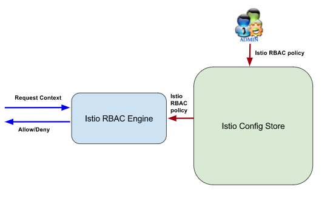
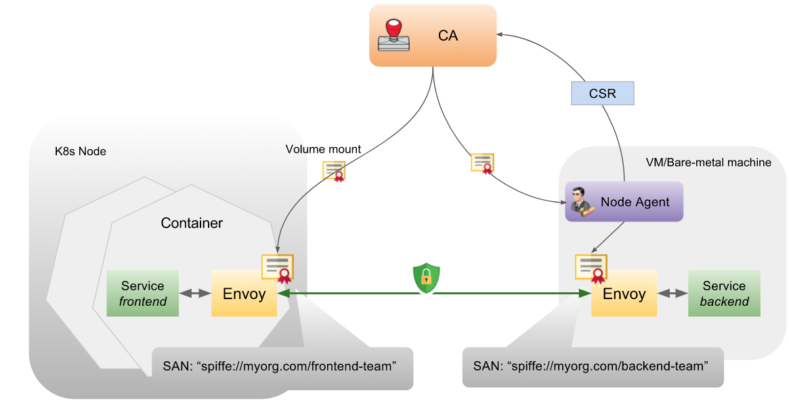

# Istio 安全管理

Istio 提供了 RBAC 访问控制以及双向 TLS 认证等安全管理功能。

## RBAC

Istio Role-Based Access Control (RBAC) 提供了 namespace、service 以及 method 级别的访问控制。其特性包括

- 简单易用：提供基于角色的语意
- 支持认证：提供服务 - 服务和用户 - 服务的认证
- 灵活：提供角色和角色绑定的自定义属性



### 开启 RBAC

```sh
# Enable RBAC for default namespace
istioctl create -f samples/bookinfo/kube/istio-rbac-enable.yaml
```

### 实现原理

在实现原理上，Istio RBAC 作为 [Mixer Adaper](https://istio.io/docs/concepts/policy-and-control/mixer.html#adapters) 对请求上下文（Request Context）进行认证，并返回授权结果：ALLOW 或者 DENY。请求上下文包含访问对象和动作等两部分，如

```yaml
apiVersion: "config.istio.io/v1alpha2"
kind: authorization
metadata:
  name: requestcontext
  namespace: istio-system
spec:
  subject:
    user: source.user | ""
    groups: ""
    properties:
      app: source.labels["app"] | ""
      version: source.labels["version"] | ""
      namespace: source.namespace | ""
  action:
    namespace: destination.namespace | ""
    service: destination.service | ""
    method: request.method | ""
    path: request.path | ""
    properties:
      app: destination.labels["app"] | ""
      version: destination.labels["version"] | ""
---
apiVersion: "config.istio.io/v1alpha2"
kind: rbac
metadata:
  name: handler
  namespace: istio-system
spec:
  config_store_url: "k8s://"
---
apiVersion: "config.istio.io/v1alpha2"
kind: rule
metadata:
  name: rbaccheck
  namespace: istio-system
spec:
  match: destination.namespace == "default"
  actions:
  - handler: handler.rbac
    instances:
    - requestcontext.authorization
```

### 访问控制

Istio RBAC 提供了 ServiceRole 和 ServiceRoleBinding 两种资源对象，并以 CustomResourceDefinition (CRD) 的方式管理。

- ServiceRole 定义了一个可访问特定资源（namespace 之内）的服务角色，并支持以前缀通配符和后缀通配符的形式匹配一组服务
- ServiceRoleBinding 定义了赋予指定角色的绑定，即可以指定的角色和动作访问服务

```yaml
apiVersion: "config.istio.io/v1alpha2"
kind: ServiceRole
metadata:
  name: service-viewer
  namespace: default
spec:
  rules:
  - services: ["*"]
    methods: ["GET"]
    constraints:
    - key: "app"
      values: ["productpage", "details", "reviews", "ratings"]
---
apiVersion: "config.istio.io/v1alpha2"
kind: ServiceRoleBinding
metadata:
  name: bind-service-viewer
  namespace: default
spec:
  subjects:
  - properties:
      namespace: "default"
  - properties:
      namespace: "istio-system"
  roleRef:
    kind: ServiceRole
    name: "service-viewer"
```

## 双向 TLS

双向 TLS 为服务间通信提供了 TLS 认证，并提供管理系统自动管理密钥和证书的生成、分发、替换以及撤销。



### 实现原理

Istio Auth 由三部分组成：

- 身份（Identity）：Istio 使用 Kubernetes service account 来识别服务的身份，格式为 `spiffe://<*domain*>/ns/<*namespace*>/sa/<*serviceaccount*>`
- 通信安全：端到端 TLS 通信通过服务器端和客户端的 Envoy 容器完成
- 证书管理：Istio CA (Certificate Authority) 负责为每个 service account 生成 SPIFEE 密钥和证书、分发到 Pod（通过 Secret Volume Mount 的形式）、定期轮转（Rotate）以及必要时撤销。对于 Kuberentes 之外的服务，CA 配合 Istio node agent 共同完成整个过程。

这样，一个容器使用证书的流程为

- 首先，Istio CA 监听 Kubernetes API，并为 service account 生成 SPIFFE 密钥及证书，再以 secret 形式存储到 Kubernetes 中
- 然后，Pod 创建时，Kubernetes API Server 将 secret 挂载到容器中
- 最后，Pilot 生成一个访问控制的配置，定义哪些 service account 可以访问服务，并分发给 Envoy
- 而当容器间通信时，Pod 双方的 Envoy 就会基于访问控制配置来作认证

### 最佳实践

- 为不同团队创建不同 namespace 分别管理
- 将 Istio CA 运行在单独的 namespace 中，并且仅授予管理员权限

## 参考文档

- [Istio Security 文档](https://istio.io/docs/concepts/security/)
- [Istio Role-Based Access Control (RBAC)](https://istio.io/docs/concepts/security/rbac.html)
- [Istio 双向 TLS 文档](https://istio.io/docs/concepts/security/mutual-tls.html)