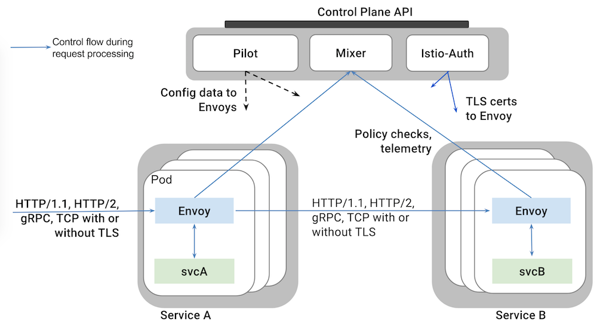

# Istio和Service Mesh

Istio是Google、IBM和Lyft联合开源的微服务 Service Mesh 框架，旨在解决大量微服务的发现、连接、管理、监控以及安全等问题。Istio对应用是透明的，不需要改动任何服务代码就可以实现透明的服务治理。

Istio的主要特性包括：

- HTTP、gRPC和TCP网络流量的自动负载均衡
- 丰富的路由规则，细粒度的网络流量行为控制
- 流量加密、服务间认证，以及强身份声明
- 全范围（Fleet-wide）策略执行
- 深度遥测和报告

## Istio原理

Istio从逻辑上可以分为数据平面和控制平面：

- 数据平面主要由一系列的智能代理（默认为Envoy）组成，管理微服务之间的网络通信
- 控制平面负责管理和配置这些智能代理，并动态执行策略

Istio架构可以如下图所示



主要由以下组件构成

- [Envoy](https://lyft.github.io/envoy/)：Lyft开源的高性能代理总线，支持动态服务发现、负载均衡、TLS终止、HTTP/2和gPRC代理、健康检查、性能测量等功能。Envoy以sidecar的方式部署在相关的服务的Pod中。
- Mixer：负责访问控制、执行策略并从Envoy代理中收集遥测数据。Mixer支持灵活的插件模型，方便扩展（支持GCP、AWS、Prometheus、Heapster等多种后端）
- Istio-Auth：提供服务间和终端用户的双向 TLS 认证
- Pilot：动态管理Envoy实例的生命周期，提供服务发现、流量管理、智能路由以及超时、熔断等弹性控制的功能。其与Envoy的关系如下图所示


在数据平面上，除了[Envoy](https://lyft.github.io/envoy/)，还可以选择使用 [nginxmesh](https://github.com/nginmesh/nginmesh) 和 [linkerd](https://linkerd.io/getting-started/istio/) 作为网络代理。比如，使用nginxmesh时，Istio的控制平面（Pilot、Mixer、Auth）保持不变，但用Nginx Sidecar取代Envoy：


## 安装

Istio 的安装部署步骤见[这里](istio-deploy.md)。

## 示例应用

### 手动注入 sidecar 容器

在部署应用时，可以通过`istioctl kube-inject`给Pod手动插入Envoy sidecar 容器，即

```sh
$  kubectl apply -f <(istioctl kube-inject --debug -f samples/bookinfo/kube/bookinfo.yaml)
service "details" configured
deployment.extensions "details-v1" configured
service "ratings" configured
deployment.extensions "ratings-v1" configured
service "reviews" configured
deployment.extensions "reviews-v1" configured
deployment.extensions "reviews-v2" configured
deployment.extensions "reviews-v3" configured
service "productpage" configured
deployment.extensions "productpage-v1" configured
ingress.extensions "gateway" configured
```

原始应用如下图所示


`istioctl kube-inject`在原始应用的每个Pod中插入了一个Envoy容器


服务启动后，可以通过Ingress地址`http://<ingress-address>/productpage`来访问BookInfo应用：

```sh
$ kubectl describe ingress
Name:			gateway
Namespace:		default
Address:		192.168.0.77
Default backend:	default-http-backend:80 (10.8.0.4:8080)
Rules:
  Host	Path	Backends
  ----	----	--------
  *
    	/productpage 	productpage:9080 (<none>)
    	/login 		productpage:9080 (<none>)
    	/logout 	productpage:9080 (<none>)
Annotations:
Events:	<none>
```


### 自动注入 sidecar 容器

首先确认 `admissionregistration` API 已经开启：

```sh
$ kubectl api-versions | grep admissionregistration
admissionregistration.k8s.io/v1beta1
```

然后部署 istio-sidecar-injector

```sh
$ ./install/kubernetes/webhook-create-signed-cert.sh \
    --service istio-sidecar-injector \
    --namespace istio-system \
    --secret sidecar-injector-certs
$ kubectl apply -f install/kubernetes/istio-sidecar-injector-configmap-release.yaml
$ cat install/kubernetes/istio-sidecar-injector.yaml | \
     ./install/kubernetes/webhook-patch-ca-bundle.sh > \
     install/kubernetes/istio-sidecar-injector-with-ca-bundle.yaml
$ kubectl apply -f install/kubernetes/istio-sidecar-injector-with-ca-bundle.yaml

# Conform istio-sidecar-injector is working
$ kubectl -n istio-system get deployment -listio=sidecar-injector
Copy
NAME                     DESIRED   CURRENT   UP-TO-DATE   AVAILABLE   AGE
istio-sidecar-injector   1         1         1            1           1d
```

然手部署应用

```sh
# default namespace 没有 istio-injection 标签
$ kubectl get namespace -L istio-injection
NAME           STATUS        AGE       ISTIO-INJECTION
default        Active        1h
istio-system   Active        1h
kube-public    Active        1h
kube-system    Active        1h

# 打上 istio-injection=enabled 标签
$ kubectl label namespace default istio-injection=enabled

# 在 default namespace 中创建 Pod 会自动添加 istio sidecar 容器
```

## 参考文档

- <https://istio.io/>
- [Istio - A modern service mesh](https://istio.io/talks/istio_talk_gluecon_2017.pdf)
- <https://lyft.github.io/envoy/>
- <https://github.com/nginmesh/nginmesh>
- [WHAT’S A SERVICE MESH? AND WHY DO I NEED ONE?](https://buoyant.io/2017/04/25/whats-a-service-mesh-and-why-do-i-need-one/)
- [A SERVICE MESH FOR KUBERNETES](https://buoyant.io/2016/10/04/a-service-mesh-for-kubernetes-part-i-top-line-service-metrics/)
- [Service Mesh Pattern](http://philcalcado.com/2017/08/03/pattern_service_mesh.html)
- [Request Routing and Policy Management with the Istio Service Mesh](http://blog.kubernetes.io/2017/10/request-routing-and-policy-management.html)
