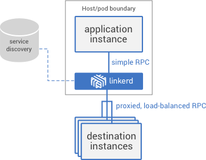

# Linkerd

Linkerd 是一个面向云原生应用的 Service Mesh 组件，也是 CNCF 项目之一。它为服务间通信提供了一个统一的管理和控制平面，并且解耦了应用程序代码和通信机制，从而无需更改应用程序就可以可视化控制服务间的通信。linkerd 实例是无状态的，可以以每个应用一个实例 (sidecar) 或者每台 Node 一个实例的方式部署。



Linkerd 的主要特性包括

- 服务发现
- 动态请求路由
- HTTP 代理集成，支持 HTTP、TLS、gRPC、HTTP/2 等
- 感知时延的负载均衡，支持多种负载均衡算法，如 Power of Two Choices (P2C) Least Loaded、Power of Two Choices (P2C) peak ewma、Aperture: least loaded、Heap: least loaded、Round robin 等
- 熔断机制，自动移除不健康的后端实例，包括 fail fast（只要连接失败就移除实例）和 failure accrual（超过 5 个请求处理失败时才将其标记为失效，并保留一定的恢复时间 ）两种
- 分布式跟踪和度量

## Linkerd 原理

Linkerd 路由将请求处理分解为多个步骤

- (1) IDENTIFICATION：为实际请求设置逻辑名字（即请求的目的服务），如默认将 HTTP 请求 `GET http://example/hello` 赋值名字 `/svc/example`
- (2) BINDING：dtabs 负责将逻辑名与客户端名字绑定起来，客户端名字总是以 `/#` 或 `/$` 开头，比如

```sh
# 假设 dtab 为
/env => /#/io.l5d.serversets/discovery
/svc => /env/prod

# 那么服务名 / svc/users 将会绑定为
/svc/users
/env/prod/users
/#/io.l5d.serversets/discovery/prod/users
```

- (3) RESOLUTION：namer 负责解析客户端名，并得到真实的服务地址（IP + 端口）
- (4) LOAD BALANCING：根据负载均衡算法选择如何发送请求


## Linkerd 部署

Linkerd 以 DaemonSet 的方式部署在每个 Node 节点上：

```sh
# Deploy linkerd.
# For CNI, deploy linkerd-cni.yml instead.
# kubectl apply -f https://github.com/linkerd/linkerd-examples/raw/master/k8s-daemonset/k8s/linkerd-cni.yml
kubectl apply -f https://raw.githubusercontent.com/linkerd/linkerd-examples/master/k8s-daemonset/k8s/linkerd.yml

# Deploy linked-viz.
kubectl apply -f https://raw.githubusercontent.com/linkerd/linkerd-viz/master/k8s/linkerd-viz.yml
```

默认情况下，Linkerd 的 Dashboard 监听在每个容器实例的 9990 端口，可以通过服务的相应端口来访问。

```sh
INGRESS_LB=$(kubectl get svc l5d -o jsonpath="{.status.loadBalancer.ingress[0].*}")
echo "open http://$INGRESS_LB:9990 in browser"

VIZ_INGRESS_LB=$(kubectl get svc linkerd-viz -o jsonpath="{.status.loadBalancer.ingress[0].*}")
echo "open http://$VIZ_INGRESS_LB in browser"
```

对于不支持 LoadBalancer 的集群，可以通过 NodePort 来访问

```sh
HOST_IP=$(kubectl get po -l app=l5d -o jsonpath="{.items[0].status.hostIP}")
echo "open http://$HOST_IP:$(kubectl get svc l5d -o'jsonpath={.spec.ports[2].nodePort}') in browser"
```

应用程序在使用 Linkerd 时需要为应用设置 HTTP 代理，其中

- HTTP 使用 `$(NODE_NAME):4140`
- HTTP/2 使用 `$(NODE_NAME):4240`
- gRPC 使用 `$(NODE_NAME):4340`

在 Kubernetes 中，可以使用 Downward API 来获取 `NODE_NAME`，比如

```yaml
    env:
    - name: NODE_NAME
      valueFrom:
        fieldRef:
          fieldPath: spec.nodeName
    - name: http_proxy
      value: $(NODE_NAME):4140
```

### 开启 TLS

```sh
kubectl apply -f https://raw.githubusercontent.com/linkerd/linkerd-examples/master/k8s-daemonset/k8s/certificates.yml
kubectl delete ds/l5d configmap/l5d-config
kubectl apply -f https://raw.githubusercontent.com/linkerd/linkerd-examples/master/k8s-daemonset/k8s/linkerd-tls.yml
```

### Zipkin

```sh
# Deploy zipkin.
kubectl apply -f https://raw.githubusercontent.com/linkerd/linkerd-examples/master/k8s-daemonset/k8s/zipkin.yml

# Deploy linkerd for zipkin.
kubectl apply -f https://raw.githubusercontent.com/linkerd/linkerd-examples/master/k8s-daemonset/k8s/linkerd-zipkin.yml

# Get zipkin endpoint.
ZIPKIN_LB=$(kubectl get svc zipkin -o jsonpath="{.status.loadBalancer.ingress[0].*}")
echo "open http://$ZIPKIN_LB in browser"
```

### Ingress Controller

Linkerd 也可以作为 Kubernetes Ingress Controller 使用，注意下面的步骤将 Linkerd 部署到了 l5d-system namespace。

```sh
kubectl create ns l5d-system
kubectl apply -f https://raw.githubusercontent.com/linkerd/linkerd-examples/master/k8s-daemonset/k8s/linkerd-ingress-controller.yml -n l5d-system

L5D_SVC_IP=$(kubectl get svc l5d -n l5d-system -o jsonpath="{.status.loadBalancer.ingress[0].*}")
echo "open http://$L5D_SVC_IP:9990 in browser"
```

## Linkerd 使用示例

接下来部署两个测试服务。

首先验证 Kubernetes 集群是否支持 nodeName，正常情况下 `node-name-test` 容器会输出一个 nslookup 解析后的 IP 地址：

```sh
kubectl apply -f https://raw.githubusercontent.com/linkerd/linkerd-examples/master/k8s-daemonset/k8s/node-name-test.yml
kubectl logs node-name-test
```

然后部署 hello world 示例：

```
kubectl apply -f https://raw.githubusercontent.com/linkerd/linkerd-examples/master/k8s-daemonset/k8s/hello-world.yml
kubectl apply -f https://raw.githubusercontent.com/linkerd/linkerd-examples/master/k8s-daemonset/k8s/world-v2.yml
```

通过 Linkerd 代理访问服务

```sh
$ http_proxy=$INGRESS_LB:4140 curl -s http://hello
Hello (10.12.2.5) world (10.12.0.6)!!
```

如果开启了 Linkerd ingress controller，那么可以继续创建 Ingress：

```sh
kubectl apply -f https://raw.githubusercontent.com/linkerd/linkerd-examples/master/k8s-daemonset/k8s/hello-world-ingress.yml

curl ${L5D_SVC_IP}
curl -H "Host: world.v2" $L5D_SVC_IP
```


## 参考文档

- [WHAT’S A SERVICE MESH? AND WHY DO I NEED ONE?](https://buoyant.io/2017/04/25/whats-a-service-mesh-and-why-do-i-need-one/)
- [Linkerd 官方文档](https://linkerd.io/documentation/)
- [A SERVICE MESH FOR KUBERNETES](https://buoyant.io/2016/10/04/a-service-mesh-for-kubernetes-part-i-top-line-service-metrics/)
- [Linkerd examples](https://github.com/linkerd/linkerd-examples)
- [Service Mesh Pattern](http://philcalcado.com/2017/08/03/pattern_service_mesh.html)
- <https://conduit.io>


