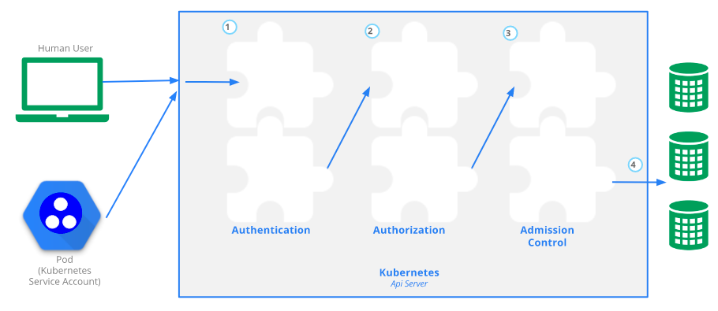

# API Server

kube-apiserver 是 Kubernetes 最重要的核心组件之一，主要提供以下的功能

- 提供集群管理的 REST API 接口，包括认证授权、数据校验以及集群状态变更等
- 提供其他模块之间的数据交互和通信的枢纽（其他模块通过 API Server 查询或修改数据，只有 API Server 才直接操作 etcd）

## REST API

kube-apiserver 支持同时提供 https（默认监听在 6443 端口）和 http API（默认监听在 127.0.0.1 的 8080 端口），其中 http API 是非安全接口，不做任何认证授权机制，不建议生产环境启用。两个接口提供的 REST API 格式相同，参考 [Kubernetes API Reference](https://kubernetes.io/docs/api-reference/v1.8/) 查看所有 API 的调用格式。

在实际使用中，通常通过 [kubectl](https://kubernetes.io/docs/user-guide/kubectl-overview/) 来访问 apiserver，也可以通过 Kubernetes 各个语言的 client 库来访问 apiserver。在使用 kubectl 时，打开调试日志也可以看到每个 API 调用的格式，比如

```sh
$ kubectl --v=8 get pods
```

可通过 `kubectl api-versions` 和 `kubectl api-resources` 查询 Kubernetes API 支持的 API 版本以及资源对象。

```sh
$ kubectl api-versions
admissionregistration.k8s.io/v1beta1
apiextensions.k8s.io/v1beta1
apiregistration.k8s.io/v1
apiregistration.k8s.io/v1beta1
apps/v1
apps/v1beta1
apps/v1beta2
authentication.k8s.io/v1
authentication.k8s.io/v1beta1
authorization.k8s.io/v1
authorization.k8s.io/v1beta1
autoscaling/v1
autoscaling/v2beta1
batch/v1
batch/v1beta1
certificates.k8s.io/v1beta1
events.k8s.io/v1beta1
extensions/v1beta1
metrics.k8s.io/v1beta1
networking.k8s.io/v1
policy/v1beta1
rbac.authorization.k8s.io/v1
rbac.authorization.k8s.io/v1beta1
scheduling.k8s.io/v1beta1
storage.k8s.io/v1
storage.k8s.io/v1beta1
v1

$ kubectl api-resources --api-group=storage.k8s.io
NAME                SHORTNAMES   APIGROUP         NAMESPACED   KIND
storageclasses      sc           storage.k8s.io   false        StorageClass
volumeattachments                storage.k8s.io   false        VolumeAttachment
```

## OpenAPI 和 Swagger

通过 `/swaggerapi` 可以查看 Swagger API，`/swagger.json` 查看 OpenAPI。

开启 `--enable-swagger-ui=true` 后还可以通过 `/swagger-ui` 访问 Swagger UI。

## 访问控制

Kubernetes API 的每个请求都会经过多阶段的访问控制之后才会被接受，这包括认证、授权以及准入控制（Admission Control）等。



### 认证

开启 TLS 时，所有的请求都需要首先认证。Kubernetes 支持多种认证机制，并支持同时开启多个认证插件（只要有一个认证通过即可）。如果认证成功，则用户的 `username` 会传入授权模块做进一步授权验证；而对于认证失败的请求则返回 HTTP 401。

> **[warning] Kubernetes 不管理用户 **
>
> 虽然 Kubernetes 认证和授权用到了 username，但 Kubernetes 并不直接管理用户，不能创建 `user` 对象，也不存储 username。

更多认证模块的使用方法可以参考 [Kubernetes 认证插件](../plugins/auth.md# 认证)。

### 授权

认证之后的请求就到了授权模块。跟认证类似，Kubernetes 也支持多种授权机制，并支持同时开启多个授权插件（只要有一个验证通过即可）。如果授权成功，则用户的请求会发送到准入控制模块做进一步的请求验证；而对于授权失败的请求则返回 HTTP 403.

更多授权模块的使用方法可以参考 [Kubernetes 授权插件](../plugins/auth.md# 授权)。

### 准入控制

准入控制（Admission Control）用来对请求做进一步的验证或添加默认参数。不同于授权和认证只关心请求的用户和操作，准入控制还处理请求的内容，并且仅对创建、更新、删除或连接（如代理）等有效，而对读操作无效。准入控制也支持同时开启多个插件，它们依次调用，只有全部插件都通过的请求才可以放过进入系统。

更多准入控制模块的使用方法可以参考 [Kubernetes 准入控制](../plugins/admission.md)。

## 启动 apiserver 示例

```sh
kube-apiserver --feature-gates=AllAlpha=true --runtime-config=api/all=true \
    --requestheader-allowed-names=front-proxy-client \
    --client-ca-file=/etc/kubernetes/pki/ca.crt \
    --allow-privileged=true \
    --experimental-bootstrap-token-auth=true \
    --storage-backend=etcd3 \
    --requestheader-username-headers=X-Remote-User \
    --requestheader-extra-headers-prefix=X-Remote-Extra- \
    --service-account-key-file=/etc/kubernetes/pki/sa.pub \
    --tls-cert-file=/etc/kubernetes/pki/apiserver.crt \
    --tls-private-key-file=/etc/kubernetes/pki/apiserver.key \
    --kubelet-client-certificate=/etc/kubernetes/pki/apiserver-kubelet-client.crt \
    --requestheader-client-ca-file=/etc/kubernetes/pki/front-proxy-ca.crt \
    --insecure-port=8080 \
    --admission-control=NamespaceLifecycle,LimitRanger,ServiceAccount,PersistentVolumeLabel,DefaultStorageClass,ResourceQuota,DefaultTolerationSeconds \
    --requestheader-group-headers=X-Remote-Group \
    --kubelet-client-key=/etc/kubernetes/pki/apiserver-kubelet-client.key \
    --secure-port=6443 \
    --kubelet-preferred-address-types=InternalIP,ExternalIP,Hostname \
    --service-cluster-ip-range=10.96.0.0/12 \
    --authorization-mode=RBAC \
    --advertise-address=192.168.0.20 --etcd-servers=http://127.0.0.1:2379
```

## 工作原理

kube-apiserver 提供了 Kubernetes 的 REST API，实现了认证、授权、准入控制等安全校验功能，同时也负责集群状态的存储操作（通过 etcd）。


## API 访问

有多种方式可以访问 Kubernetes 提供的 REST API：

- [kubectl](kubectl.md) 命令行工具
- SDK，支持多种语言
  - [Go](https://github.com/kubernetes/client-go)
  - [Python](https://github.com/kubernetes-incubator/client-python)
  - [Javascript](https://github.com/kubernetes-client/javascript)
  - [Java](https://github.com/kubernetes-client/java)
  - [CSharp](https://github.com/kubernetes-client/csharp)
  - 其他 [OpenAPI](https://www.openapis.org/) 支持的语言，可以通过 [gen](https://github.com/kubernetes-client/gen) 工具生成相应的 client

### kubectl

```sh
kubectl get --raw /api/v1/namespaces
kubectl get --raw /apis/metrics.k8s.io/v1beta1/nodes
kubectl get --raw /apis/metrics.k8s.io/v1beta1/pods
```

### kubectl proxy

```sh
$ kubectl proxy --port=8080 &

$ curl http://localhost:8080/api/
{
  "versions": [
    "v1"
  ]
}
```

### curl

```sh
$ APISERVER=$(kubectl config view | grep server | cut -f 2- -d ":" | tr -d " ")
$ TOKEN=$(kubectl describe secret $(kubectl get secrets | grep default | cut -f1 -d '') | grep -E'^token'| cut -f2 -d':'| tr -d'\t')
$ curl $APISERVER/api --header "Authorization: Bearer $TOKEN" --insecure
{
  "kind": "APIVersions",
  "versions": [
    "v1"
  ],
  "serverAddressByClientCIDRs": [
    {
      "clientCIDR": "0.0.0.0/0",
      "serverAddress": "10.0.1.149:443"
    }
  ]
}
```

## API 参考文档

- [v1.6 API Reference](https://kubernetes.io/docs/api-reference/v1.6)
- [v1.7 API Reference](https://kubernetes.io/docs/api-reference/v1.7/)
- [v1.8 API Reference](https://kubernetes.io/docs/api-reference/v1.8/)
- [v1.9 API Reference](https://kubernetes.io/docs/api-reference/v1.9/)
- [v1.10 API Reference](https://kubernetes.io/docs/reference/generated/kubernetes-api/v1.10/)
