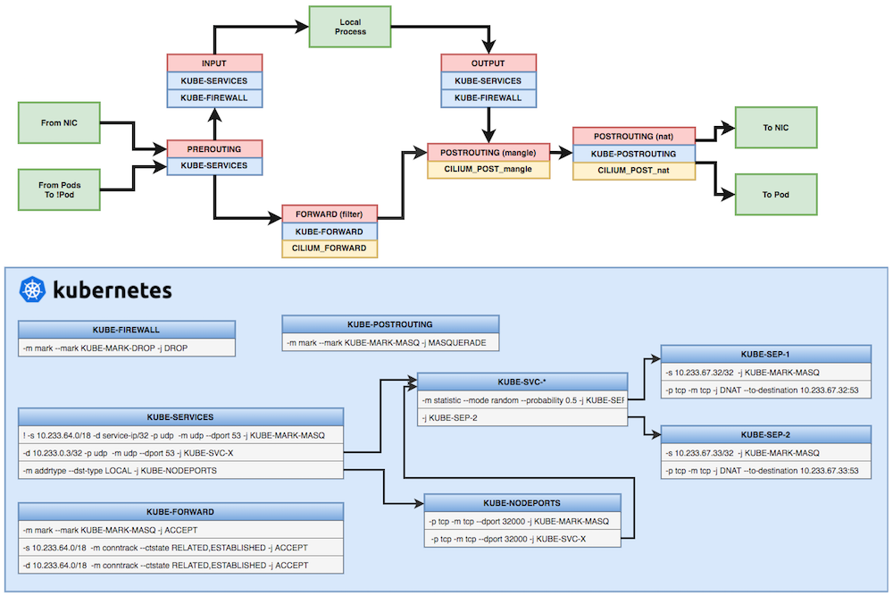

# kube-proxy

每台机器上都运行一个 kube-proxy 服务，它监听 API server 中 service 和 endpoint 的变化情况，并通过 iptables 等来为服务配置负载均衡（仅支持 TCP 和 UDP）。

kube-proxy 可以直接运行在物理机上，也可以以 static pod 或者 daemonset 的方式运行。

kube-proxy 当前支持一下几种实现

- userspace：最早的负载均衡方案，它在用户空间监听一个端口，所有服务通过 iptables 转发到这个端口，然后在其内部负载均衡到实际的 Pod。该方式最主要的问题是效率低，有明显的性能瓶颈。
- iptables：目前推荐的方案，完全以 iptables 规则的方式来实现 service 负载均衡。该方式最主要的问题是在服务多的时候产生太多的 iptables 规则，非增量式更新会引入一定的时延，大规模情况下有明显的性能问题
- ipvs：为解决 iptables 模式的性能问题，v1.8 新增了 ipvs 模式，采用增量式更新，并可以保证 service 更新期间连接保持不断开
- winuserspace：同 userspace，但仅工作在 windows 上

注意：使用 ipvs 模式时，需要预先在每台 Node 上加载内核模块 `nf_conntrack_ipv4`, `ip_vs`, `ip_vs_rr`, `ip_vs_wrr`, `ip_vs_sh`  等。

## Iptables 示例



```sh
# Masquerade
-A KUBE-MARK-DROP -j MARK --set-xmark 0x8000/0x8000
-A KUBE-MARK-MASQ -j MARK --set-xmark 0x4000/0x4000
-A KUBE-POSTROUTING -m comment --comment "kubernetes service traffic requiring SNAT" -m mark --mark 0x4000/0x4000 -j MASQUERADE

# clusterIP and publicIP
-A KUBE-SERVICES ! -s 10.244.0.0/16 -d 10.98.154.163/32 -p tcp -m comment --comment "default/nginx: cluster IP" -m tcp --dport 80 -j KUBE-MARK-MASQ
-A KUBE-SERVICES -d 10.98.154.163/32 -p tcp -m comment --comment "default/nginx: cluster IP" -m tcp --dport 80 -j KUBE-SVC-4N57TFCL4MD7ZTDA
-A KUBE-SERVICES -d 12.12.12.12/32 -p tcp -m comment --comment "default/nginx: loadbalancer IP" -m tcp --dport 80 -j KUBE-FW-4N57TFCL4MD7ZTDA

# Masq for publicIP
-A KUBE-FW-4N57TFCL4MD7ZTDA -m comment --comment "default/nginx: loadbalancer IP" -j KUBE-MARK-MASQ
-A KUBE-FW-4N57TFCL4MD7ZTDA -m comment --comment "default/nginx: loadbalancer IP" -j KUBE-SVC-4N57TFCL4MD7ZTDA
-A KUBE-FW-4N57TFCL4MD7ZTDA -m comment --comment "default/nginx: loadbalancer IP" -j KUBE-MARK-DROP

# Masq for nodePort
-A KUBE-NODEPORTS -p tcp -m comment --comment "default/nginx:" -m tcp --dport 30938 -j KUBE-MARK-MASQ
-A KUBE-NODEPORTS -p tcp -m comment --comment "default/nginx:" -m tcp --dport 30938 -j KUBE-SVC-4N57TFCL4MD7ZTDA

# load balance for each endpoints
-A KUBE-SVC-4N57TFCL4MD7ZTDA -m comment --comment "default/nginx:" -m statistic --mode random --probability 0.33332999982 -j KUBE-SEP-UXHBWR5XIMVGXW3H
-A KUBE-SVC-4N57TFCL4MD7ZTDA -m comment --comment "default/nginx:" -m statistic --mode random --probability 0.50000000000 -j KUBE-SEP-TOYRWPNILILHH3OR
-A KUBE-SVC-4N57TFCL4MD7ZTDA -m comment --comment "default/nginx:" -j KUBE-SEP-6QCC2MHJZP35QQAR

# endpoint #1
-A KUBE-SEP-6QCC2MHJZP35QQAR -s 10.244.3.4/32 -m comment --comment "default/nginx:" -j KUBE-MARK-MASQ
-A KUBE-SEP-6QCC2MHJZP35QQAR -p tcp -m comment --comment "default/nginx:" -m tcp -j DNAT --to-destination 10.244.3.4:80

# endpoint #2
-A KUBE-SEP-TOYRWPNILILHH3OR -s 10.244.2.4/32 -m comment --comment "default/nginx:" -j KUBE-MARK-MASQ
-A KUBE-SEP-TOYRWPNILILHH3OR -p tcp -m comment --comment "default/nginx:" -m tcp -j DNAT --to-destination 10.244.2.4:80

# endpoint #3
-A KUBE-SEP-UXHBWR5XIMVGXW3H -s 10.244.1.2/32 -m comment --comment "default/nginx:" -j KUBE-MARK-MASQ
-A KUBE-SEP-UXHBWR5XIMVGXW3H -p tcp -m comment --comment "default/nginx:" -m tcp -j DNAT --to-destination 10.244.1.2:80
```

如果服务设置了 `externalTrafficPolicy: Local` 并且当前 Node 上面没有任何属于该服务的 Pod，那么在 `KUBE-XLB-4N57TFCL4MD7ZTDA` 中会直接丢掉从公网 IP 请求的包：

```sh
-A KUBE-XLB-4N57TFCL4MD7ZTDA -m comment --comment "default/nginx: has no local endpoints" -j KUBE-MARK-DROP
```

## ipvs 示例


```sh
$ ipvsadm -ln
IP Virtual Server version 1.2.1 (size=4096)
Prot LocalAddress:Port Scheduler Flags
  -> RemoteAddress:Port           Forward Weight ActiveConn InActConn
TCP  10.111.21.136:80 rr persistent 10800
  -> 192.168.23.130:80            Masq    1      0          0
  -> 192.168.23.134:80            Masq    1      0          0
```

## 启动 kube-proxy 示例

```sh
kube-proxy --kubeconfig=/var/lib/kube-proxy/kubeconfig.conf
```

## kube-proxy 工作原理

kube-proxy 监听 API server 中 service 和 endpoint 的变化情况，并通过 userspace、iptables、ipvs 或 winuserspace 等 proxier 来为服务配置负载均衡（仅支持 TCP 和 UDP）。


## kube-proxy 不足

kube-proxy 目前仅支持 TCP 和 UDP，不支持 HTTP 路由，并且也没有健康检查机制。这些可以通过自定义 [Ingress Controller](../plugins/ingress.md) 的方法来解决。
