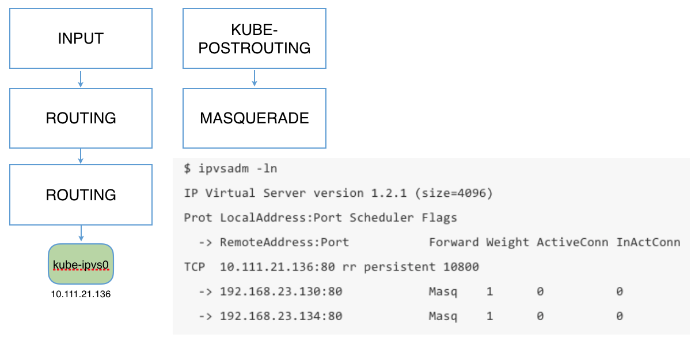

# kube-proxy

每台机器上都运行一个kube-proxy服务，它监听API server中service和endpoint的变化情况，并通过iptables等来为服务配置负载均衡（仅支持TCP和UDP）。

kube-proxy可以直接运行在物理机上，也可以以static pod或者daemonset的方式运行。

kube-proxy当前支持一下几种实现

- userspace：最早的负载均衡方案，它在用户空间监听一个端口，所有服务通过iptables转发到这个端口，然后在其内部负载均衡到实际的Pod。该方式最主要的问题是效率低，有明显的性能瓶颈。
- iptables：目前推荐的方案，完全以iptables规则的方式来实现service负载均衡。该方式最主要的问题是在服务多的时候产生太多的iptables规则，非增量式更新会引入一定的时延，大规模情况下有明显的性能问题
- ipvs：为解决iptables模式的性能问题，v1.8新增了ipvs模式，采用增量式更新，并可以保证service更新期间连接保持不断开
- winuserspace：同userspace，但仅工作在windows上

注意：使用ipvs模式时，需要预先在每台Node上加载内核模块`nf_conntrack_ipv4`, `ip_vs`, `ip_vs_rr`, `ip_vs_wrr`, `ip_vs_sh`  等。

## Iptables示例


```sh
-A KUBE-MARK-DROP -j MARK --set-xmark 0x8000/0x8000
-A KUBE-MARK-MASQ -j MARK --set-xmark 0x4000/0x4000
-A KUBE-POSTROUTING -m comment --comment "kubernetes service traffic requiring SNAT" -m mark --mark 0x4000/0x4000 -j MASQUERADE

-A KUBE-SEP-55QZ6T7MF3AHPOOB -s 10.244.1.6/32 -m comment --comment "default/http:" -j KUBE-MARK-MASQ
-A KUBE-SEP-55QZ6T7MF3AHPOOB -p tcp -m comment --comment "default/http:" -m tcp -j DNAT --to-destination 10.244.1.6:80

-A KUBE-SEP-KJZJRL2KRWMXNR3J -s 10.244.1.5/32 -m comment --comment "default/http:" -j KUBE-MARK-MASQ
-A KUBE-SEP-KJZJRL2KRWMXNR3J -p tcp -m comment --comment "default/http:" -m tcp -j DNAT --to-destination 10.244.1.5:80

-A KUBE-SERVICES -d 10.101.85.234/32 -p tcp -m comment --comment "default/http: cluster IP" -m tcp --dport 80 -j KUBE-SVC-7IMAZDGB2ONQNK4Z
-A KUBE-SVC-7IMAZDGB2ONQNK4Z -m comment --comment "default/http:" -m statistic --mode random --probability 0.50000000000 -j KUBE-SEP-KJZJRL2KRWMXNR3J
-A KUBE-SVC-7IMAZDGB2ONQNK4Z -m comment --comment "default/http:" -j KUBE-SEP-55QZ6T7MF3AHPOOB
```

## ipvs示例



```sh
$ ipvsadm -ln
IP Virtual Server version 1.2.1 (size=4096)
Prot LocalAddress:Port Scheduler Flags
  -> RemoteAddress:Port           Forward Weight ActiveConn InActConn
TCP  10.111.21.136:80 rr persistent 10800
  -> 192.168.23.130:80            Masq    1      0          0
  -> 192.168.23.134:80            Masq    1      0          0
```

## 启动kube-proxy示例

```sh
kube-proxy --kubeconfig=/var/lib/kube-proxy/kubeconfig.conf
```

## kube-proxy不足

kube-proxy目前仅支持TCP和UDP，不支持HTTP路由，并且也没有健康检查机制。这些可以通过自定义Ingress Controller的方法来解决。
