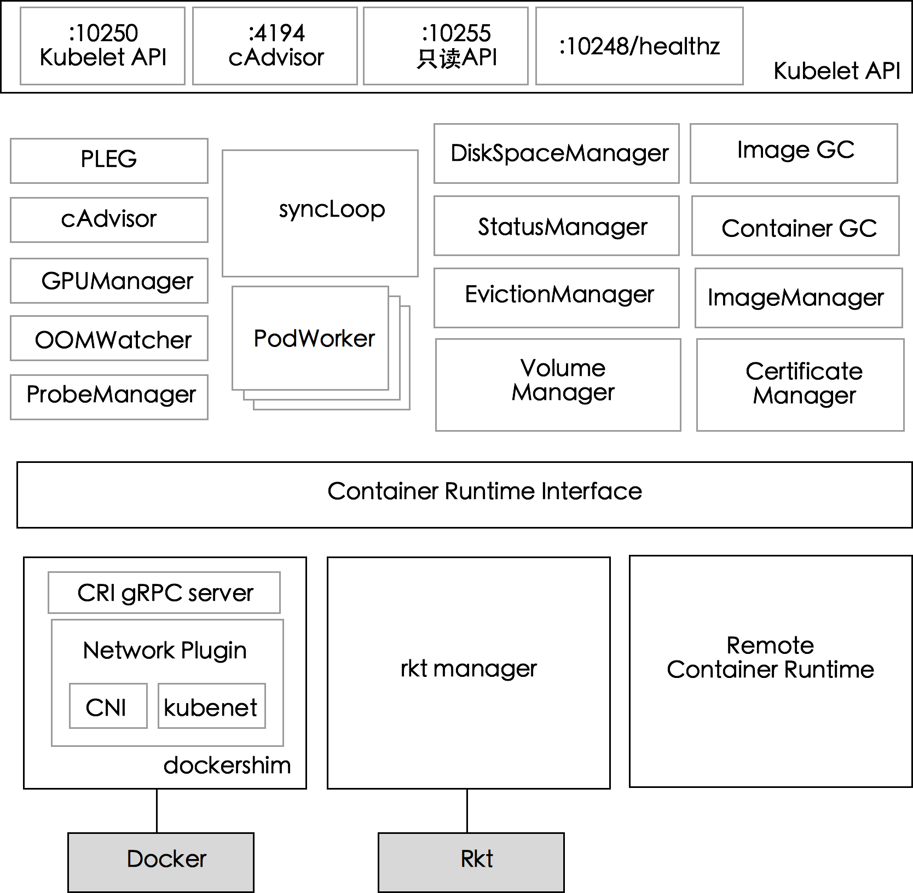

# Kubelet

每个节点上都运行一个 kubelet 服务进程，默认监听 10250 端口，接收并执行 master 发来的指令，管理 Pod 及 Pod 中的容器。每个 kubelet 进程会在 API Server 上注册节点自身信息，定期向 master 节点汇报节点的资源使用情况，并通过 cAdvisor 监控节点和容器的资源。

## 节点管理

节点管理主要是节点自注册和节点状态更新：

- Kubelet 可以通过设置启动参数 --register-node 来确定是否向 API Server 注册自己；
- 如果 Kubelet 没有选择自注册模式，则需要用户自己配置 Node 资源信息，同时需要告知 Kubelet 集群上的 API Server 的位置；
- Kubelet 在启动时通过 API Server 注册节点信息，并定时向 API Server 发送节点新消息，API Server 在接收到新消息后，将信息写入 etcd

## Pod 管理

### 获取 Pod 清单

Kubelet 以 PodSpec 的方式工作。PodSpec 是描述一个 Pod 的 YAML 或 JSON 对象。 kubelet 采用一组通过各种机制提供的 PodSpecs（主要通过 apiserver），并确保这些 PodSpecs 中描述的 Pod 正常健康运行。

向 Kubelet 提供节点上需要运行的 Pod 清单的方法：

- 文件：启动参数 --config 指定的配置目录下的文件 (默认 / etc/kubernetes/manifests/)。该文件每 20 秒重新检查一次（可配置）。
- HTTP endpoint (URL)：启动参数 --manifest-url 设置。每 20 秒检查一次这个端点（可配置）。
- API Server：通过 API Server 监听 etcd 目录，同步 Pod 清单。
- HTTP server：kubelet 侦听 HTTP 请求，并响应简单的 API 以提交新的 Pod 清单。

### 通过 API Server 获取 Pod 清单及创建 Pod 的过程

Kubelet 通过 API Server Client(Kubelet 启动时创建)使用 Watch 加 List 的方式监听 "/registry/nodes/$ 当前节点名" 和 “/registry/pods” 目录，将获取的信息同步到本地缓存中。

Kubelet 监听 etcd，所有针对 Pod 的操作都将会被 Kubelet 监听到。如果发现有新的绑定到本节点的 Pod，则按照 Pod 清单的要求创建该 Pod。

如果发现本地的 Pod 被修改，则 Kubelet 会做出相应的修改，比如删除 Pod 中某个容器时，则通过 Docker Client 删除该容器。
如果发现删除本节点的 Pod，则删除相应的 Pod，并通过 Docker Client 删除 Pod 中的容器。

Kubelet 读取监听到的信息，如果是创建和修改 Pod 任务，则执行如下处理：

- 为该 Pod 创建一个数据目录；
- 从 API Server 读取该 Pod 清单；
- 为该 Pod 挂载外部卷；
- 下载 Pod 用到的 Secret；
- 检查已经在节点上运行的 Pod，如果该 Pod 没有容器或 Pause 容器没有启动，则先停止 Pod 里所有容器的进程。如果在 Pod 中有需要删除的容器，则删除这些容器；
- 用 “kubernetes/pause” 镜像为每个 Pod 创建一个容器。Pause 容器用于接管 Pod 中所有其他容器的网络。每创建一个新的 Pod，Kubelet 都会先创建一个 Pause 容器，然后创建其他容器。
- 为 Pod 中的每个容器做如下处理：
  1. 为容器计算一个 hash 值，然后用容器的名字去 Docker 查询对应容器的 hash 值。若查找到容器，且两者 hash 值不同，则停止 Docker 中容器的进程，并停止与之关联的 Pause 容器的进程；若两者相同，则不做任何处理；
  1. 如果容器被终止了，且容器没有指定的 restartPolicy，则不做任何处理；
  1. 调用 Docker Client 下载容器镜像，调用 Docker Client 运行容器。

### Static Pod

所有以非 API Server 方式创建的 Pod 都叫 Static Pod。Kubelet 将 Static Pod 的状态汇报给 API Server，API Server 为该 Static Pod 创建一个 Mirror Pod 和其相匹配。Mirror Pod 的状态将真实反映 Static Pod 的状态。当 Static Pod 被删除时，与之相对应的 Mirror Pod 也会被删除。

## 容器健康检查

Pod 通过两类探针检查容器的健康状态:

- (1) LivenessProbe 探针：用于判断容器是否健康，告诉 Kubelet 一个容器什么时候处于不健康的状态。如果 LivenessProbe 探针探测到容器不健康，则 Kubelet 将删除该容器，并根据容器的重启策略做相应的处理。如果一个容器不包含 LivenessProbe 探针，那么 Kubelet 认为该容器的 LivenessProbe 探针返回的值永远是 “Success”；
- (2)ReadinessProbe：用于判断容器是否启动完成且准备接收请求。如果 ReadinessProbe 探针探测到失败，则 Pod 的状态将被修改。Endpoint Controller 将从 Service 的 Endpoint 中删除包含该容器所在 Pod 的 IP 地址的 Endpoint 条目。

Kubelet 定期调用容器中的 LivenessProbe 探针来诊断容器的健康状况。LivenessProbe 包含如下三种实现方式：

- ExecAction：在容器内部执行一个命令，如果该命令的退出状态码为 0，则表明容器健康；
- TCPSocketAction：通过容器的 IP 地址和端口号执行 TCP 检查，如果端口能被访问，则表明容器健康；
- HTTPGetAction：通过容器的 IP 地址和端口号及路径调用 HTTP GET 方法，如果响应的状态码大于等于 200 且小于 400，则认为容器状态健康。

LivenessProbe 探针包含在 Pod 定义的 spec.containers.{某个容器} 中。

## cAdvisor 资源监控

Kubernetes 集群中，应用程序的执行情况可以在不同的级别上监测到，这些级别包括：容器、Pod、Service 和整个集群。
Heapster 项目为 Kubernetes 提供了一个基本的监控平台，它是集群级别的监控和事件数据集成器 (Aggregator)。Heapster 以 Pod 的方式运行在集群中，Heapster 通过 Kubelet 发现所有运行在集群中的节点，并查看来自这些节点的资源使用情况。Kubelet 通过 cAdvisor 获取其所在节点及容器的数据。Heapster 通过带着关联标签的 Pod 分组这些信息，这些数据将被推到一个可配置的后端，用于存储和可视化展示。支持的后端包括 InfluxDB(使用 Grafana 实现可视化) 和 Google Cloud Monitoring。
cAdvisor 是一个开源的分析容器资源使用率和性能特性的代理工具，已集成到 Kubernetes 代码中。cAdvisor 自动查找所有在其所在节点上的容器，自动采集 CPU、内存、文件系统和网络使用的统计信息。cAdvisor 通过它所在节点机的 Root 容器，采集并分析该节点机的全面使用情况。
cAdvisor 通过其所在节点机的 4194 端口暴露一个简单的 UI。

## 启动 kubelet 示例

```sh
/usr/bin/kubelet --kubeconfig=/etc/kubernetes/kubelet.conf \
    --require-kubeconfig=true \
    --pod-manifest-path=/etc/kubernetes/manifests \
    --allow-privileged=true \
    --network-plugin=cni \
    --cni-conf-dir=/etc/cni/net.d \
    --cni-bin-dir=/opt/cni/bin \
    --cluster-dns=10.96.0.10 \
    --cluster-domain=cluster.local \
    --authorization-mode=Webhook \
    --client-ca-file=/etc/kubernetes/pki/ca.crt \
    --feature-gates=AllAlpha=true
```

## kubelet 工作原理

如下 kubelet 内部组件结构图所示，Kubelet 由许多内部组件构成

- Kubelet API，包括 10250 端口的认证 API、4194 端口的 cAdvisor API、10255 端口的只读 API 以及 10248 端口的健康检查 API
- syncLoop：从 API 或者 manifest 目录接收 Pod 更新，发送到 podWorkers 处理，大量使用 channel 处理来处理异步请求
- 辅助的 manager，如 cAdvisor、PLEG、Volume Manager 等，处理 syncLoop 以外的其他工作
- CRI：容器执行引擎接口，负责与 container runtime shim 通信
- 容器执行引擎，如 dockershim、rkt 等（注：rkt 暂未完成 CRI 的迁移）
- 网络插件，目前支持 CNI 和 kubenet



### Pod 启动流程


### 查询 Node 汇总指标

通过 Kubelet 的 10255 端口可以查询 Node 的汇总指标。有两种访问方式

- 在集群内部可以直接访问 kubelet 的 10255 端口，比如 `http://<node-name>:10255/stats/summary`
- 在集群外部可以借助 `kubectl proxy` 来访问，比如

```sh
kubectl proxy&
curl http://localhost:8001/api/v1/proxy/nodes/<node-name>:10255/stats/summary
```
