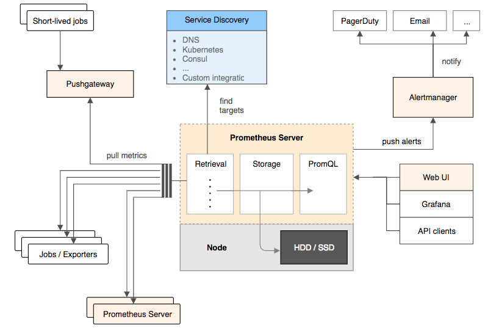

# Kubernetes 监控

> ** 注意事项 **
>
> - 标签非常重要，是应用分组的重要依据
> - 多维度的监控，包括集群内的所有节点、容器、容器内的应用以及 Kubernetes 自身
> - 天生分布式，对复杂应用的监控聚合是个挑战

## cAdvisor

[cAdvisor](https://github.com/google/cadvisor) 是一个来自 Google 的容器监控工具，也是 Kubelet 内置的容器资源收集工具。它会自动收集本机容器 CPU、内存、网络和文件系统的资源占用情况，并对外提供 cAdvisor 原生的 API（默认端口为 `--cadvisor-port=4194`）。


## InfluxDB 和 Grafana

[InfluxDB](https://www.influxdata.com/time-series-platform/influxdb/) 是一个开源分布式时序、事件和指标数据库；而 [Grafana](http://grafana.org/) 则是 InfluxDB 的 Dashboard，提供了强大的图表展示功能。它们常被组合使用展示图表化的监控数据。


## Heapster

前面提到的 cAdvisor 只提供了单机的容器资源占用情况，而 [Heapster](https://github.com/kubernetes/heapster) 则提供了整个集群的资源监控，并支持持久化数据存储到 InfluxDB、Google Cloud Monitoring 或者 [其他的存储后端](https://github.com/kubernetes/heapster)。

Heapster 从 kubelet 提供的 Summary API 采集节点和容器的资源占用：


另外，Heapster 的 `/metrics` API 提供了 Prometheus 格式的数据。

### 部署 Heapster、InfluxDB 和 Grafana

在 Kubernetes 部署成功后，dashboard、DNS 和监控的服务也会默认部署好，比如通过 `cluster/kube-up.sh` 部署的集群默认会开启以下服务：

```sh
$ kubectl cluster-info
Kubernetes master is running at https://kubernetes-master
Heapster is running at https://kubernetes-master/api/v1/proxy/namespaces/kube-system/services/heapster
KubeDNS is running at https://kubernetes-master/api/v1/proxy/namespaces/kube-system/services/kube-dns
kubernetes-dashboard is running at https://kubernetes-master/api/v1/proxy/namespaces/kube-system/services/kubernetes-dashboard
Grafana is running at https://kubernetes-master/api/v1/proxy/namespaces/kube-system/services/monitoring-grafana
InfluxDB is running at https://kubernetes-master/api/v1/proxy/namespaces/kube-system/services/monitoring-influxdb
```

如果这些服务没有自动部署的话，可以参考 [kubernetes/heapster](https://github.com/kubernetes/heapster/tree/master/deploy/kube-config) 来部署这些服务。

## Prometheus

[Prometheus](https://prometheus.io) 是另外一个监控和时间序列数据库，并且还提供了告警的功能。它提供了强大的查询语言和 HTTP 接口，也支持将数据导出到 Grafana 中展示。



使用 Prometheus 监控 Kubernetes 需要配置好数据源，一个简单的示例是 [prometheus.yml](prometheus.txt)：

```sh
kubectl apply -f https://raw.githubusercontent.com/feiskyer/kubernetes-handbook/master/monitor/prometheus.txt
```


推荐使用 [Prometheus Operator](https://github.com/coreos/prometheus-operator) 或 [Prometheus Chart](https://github.com/kubernetes/charts/tree/master/stable/prometheus) 来部署和管理 Prometheus，比如

```sh
# 注意：未开启 RBAC 时，需要去掉 --set rbac.create=true 选项
helm install --name my-release stable/prometheus --set rbac.create=true
```

## Kubelet Metrics

从 v1.7 开始，Kubelet metrics API 不再包含 cadvisor metrics，而是提供了一个独立的 API 接口：

- Kubelet metrics: `http://127.0.0.1:8001/api/v1/proxy/nodes/<node-name>/metrics`
- Cadvisor metrics: `http://127.0.0.1:8001/api/v1/proxy/nodes/<node-name>/metrics/cadvisor`

然而 cadvisor metrics 通常是监控系统必需的数据。给 Prometheus 增加新的 target 可以解决这个问题，比如

```sh
# add repo
helm repo add feisky https://feisky.xyz/kubernetes-charts
helm update
helm install feisky/prometheus --set rbac.create=true --name prometheus --namespace kube-system
```

## Node Problem Detector

Kubernetes node 有可能会出现各种硬件、内核或者运行时等问题，这些问题有可能导致服务异常。而 Node Problem Detector（NPD）就是用来监测这些异常的服务。NPD 以 DaemonSet 的方式运行在每台 Node 上面，并在异常发生时更新 NodeCondition（比如 KernelDaedlock、DockerHung、BadDisk 等）或者 Node Event（比如 OOM Kill 等）。

可以参考 [kubernetes/node-problem-detector](https://github.com/kubernetes/node-problem-detector#start-daemonset) 来部署 NPD，或者也可以使用 Helm 来部署：

```sh
# add repo
helm repo add feisky https://feisky.xyz/kubernetes-charts
helm update

# install packages
helm install feisky/node-problem-detector --namespace kube-system --name npd
```

## 其他容器监控系统

- [Sysdig](http://blog.kubernetes.io/2015/11/monitoring-Kubernetes-with-Sysdig.html)
- [CoScale](https://www.coscale.com/)
- [Datadog](https://www.datadoghq.com/)
- [Sematext](https://sematext.com/)
