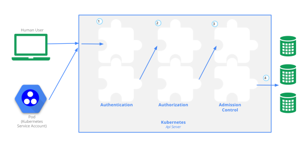

# 访问控制

Kubernetes 对 API 访问提供了三种安全访问控制措施：认证、授权和 Admission Control。认证解决用户是谁的问题，授权解决用户能做什么的问题，Admission Control 则是资源管理方面的作用。通过合理的权限管理，能够保证系统的安全可靠。

Kubernetes 集群的所有操作基本上都是通过 kube-apiserver 这个组件进行的，它提供 HTTP RESTful 形式的 API 供集群内外客户端调用。需要注意的是：认证授权过程只存在 HTTPS 形式的 API 中。也就是说，如果客户端使用 HTTP 连接到 kube-apiserver，那么是不会进行认证授权的。所以说，可以这么设置，在集群内部组件间通信使用 HTTP，集群外部就使用 HTTPS，这样既增加了安全性，也不至于太复杂。

下图是 API 访问要经过的三个步骤，前面两个是认证和授权，第三个是 Admission Control。



## 认证

开启 TLS 时，所有的请求都需要首先认证。Kubernetes 支持多种认证机制，并支持同时开启多个认证插件（只要有一个认证通过即可）。如果认证成功，则用户的 `username` 会传入授权模块做进一步授权验证；而对于认证失败的请求则返回 HTTP 401。

> **[warning] Kubernetes 不管理用户 **
>
> 虽然 Kubernetes 认证和授权用到了 username，但 Kubernetes 并不直接管理用户，不能创建 `user` 对象，
> 也不存储 username。但是 Kubernetes 提供了 Service Account，用来与 API 交互。

目前，Kubernetes 支持以下认证插件：

- X509 证书
- 静态 Token 文件
- 引导 Token
- 静态密码文件
- Service Account
- OpenID
- Webhook
- 认证代理
- OpenStack Keystone 密码

详细使用方法请参考[这里](authentication.md)

## 授权

授权主要是用于对集群资源的访问控制，通过检查请求包含的相关属性值，与相对应的访问策略相比较，API 请求必须满足某些策略才能被处理。跟认证类似，Kubernetes 也支持多种授权机制，并支持同时开启多个授权插件（只要有一个验证通过即可）。如果授权成功，则用户的请求会发送到准入控制模块做进一步的请求验证；对于授权失败的请求则返回 HTTP 403。

Kubernetes 授权仅处理以下的请求属性：

- user, group, extra
- API、请求方法（如 get、post、update、patch 和 delete）和请求路径（如 `/api`）
- 请求资源和子资源
- Namespace
- API Group

目前，Kubernetes 支持以下授权插件：

- ABAC
- RBAC
- Webhook
- Node

> **[info] AlwaysDeny 和 AlwaysAllow**
>
> Kubernetes 还支持 AlwaysDeny 和 AlwaysAllow 模式，其中 AlwaysDeny 仅用来测试，而 AlwaysAllow 则
> 允许所有请求（会覆盖其他模式）。

### ABAC 授权

使用 ABAC 授权需要 API Server 配置 `--authorization-policy-file=SOME_FILENAME`，文件格式为每行一个 json 对象，比如

```json
{
    "apiVersion": "abac.authorization.kubernetes.io/v1beta1",
    "kind": "Policy",
    "spec": {
        "group": "system:authenticated",
        "nonResourcePath": "*",
        "readonly": true
    }
}
{
    "apiVersion": "abac.authorization.kubernetes.io/v1beta1",
    "kind": "Policy",
    "spec": {
        "group": "system:unauthenticated",
        "nonResourcePath": "*",
        "readonly": true
    }
}
{
    "apiVersion": "abac.authorization.kubernetes.io/v1beta1",
    "kind": "Policy",
    "spec": {
        "user": "admin",
        "namespace": "*",
        "resource": "*",
        "apiGroup": "*"
    }
}
```

### RBAC 授权

见 [RBAC 授权](rbac.md)。

### WebHook 授权

使用 WebHook 授权需要 API Server 配置 `--authorization-webhook-config-file=SOME_FILENAME` 和 `--runtime-config=authorization.k8s.io/v1beta1=true`，配置文件格式同 kubeconfig，如

```yaml
# clusters refers to the remote service.
clusters:
  - name: name-of-remote-authz-service
    cluster:
      # CA for verifying the remote service.
      certificate-authority: /path/to/ca.pem
      # URL of remote service to query. Must use 'https'.
      server: https://authz.example.com/authorize

# users refers to the API Server's webhook configuration.
users:
  - name: name-of-api-server
    user:
      # cert for the webhook plugin to use
      client-certificate: /path/to/cert.pem
       # key matching the cert
      client-key: /path/to/key.pem

# kubeconfig files require a context. Provide one for the API Server.
current-context: webhook
contexts:
- context:
    cluster: name-of-remote-authz-service
    user: name-of-api-server
  name: webhook
```

API Server 请求 Webhook server 的格式为

```json
{
  "apiVersion": "authorization.k8s.io/v1beta1",
  "kind": "SubjectAccessReview",
  "spec": {
    "resourceAttributes": {
      "namespace": "kittensandponies",
      "verb": "get",
      "group": "unicorn.example.org",
      "resource": "pods"
    },
    "user": "jane",
    "group": [
      "group1",
      "group2"
    ]
  }
}
```

而 Webhook server 需要返回授权的结果，允许 (allowed=true) 或拒绝(allowed=false)：

```json
{
  "apiVersion": "authorization.k8s.io/v1beta1",
  "kind": "SubjectAccessReview",
  "status": {
    "allowed": true
  }
}
```

### Node 授权

v1.7 + 支持 Node 授权，配合 `NodeRestriction` 准入控制来限制 kubelet 仅可访问 node、endpoint、pod、service 以及 secret、configmap、PV 和 PVC 等相关的资源，配置方法为

`--authorization-mode=Node,RBAC --admission-control=...,NodeRestriction,...`

注意，kubelet 认证需要使用 `system:nodes` 组，并使用用户名 `system:node:<nodeName>`。

## 参考文档

- [Authenticating](https://kubernetes.io/docs/admin/authentication/)
- [Authorization](https://kubernetes.io/docs/admin/authorization/)
- [Bootstrap Tokens](https://kubernetes.io/docs/admin/bootstrap-tokens/)
- [Managing Service Accounts](https://kubernetes.io/docs/admin/service-accounts-admin/)
- [ABAC Mode](https://kubernetes.io/docs/admin/authorization/abac/)
- [Webhook Mode](https://kubernetes.io/docs/admin/authorization/webhook/)
- [Node Authorization](https://kubernetes.io/docs/admin/authorization/node/)
