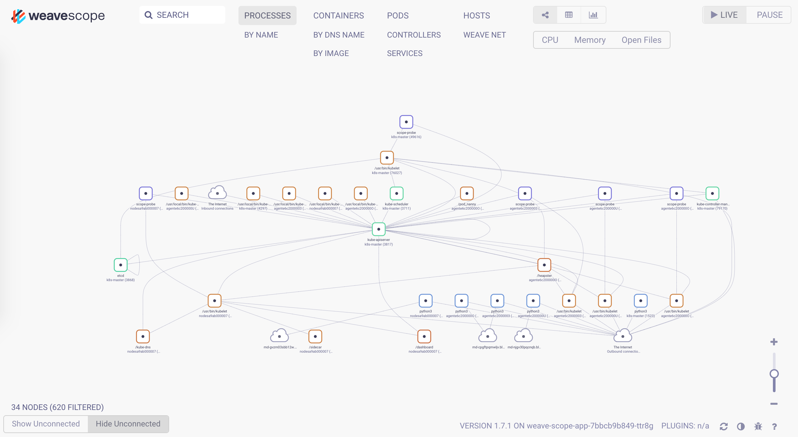
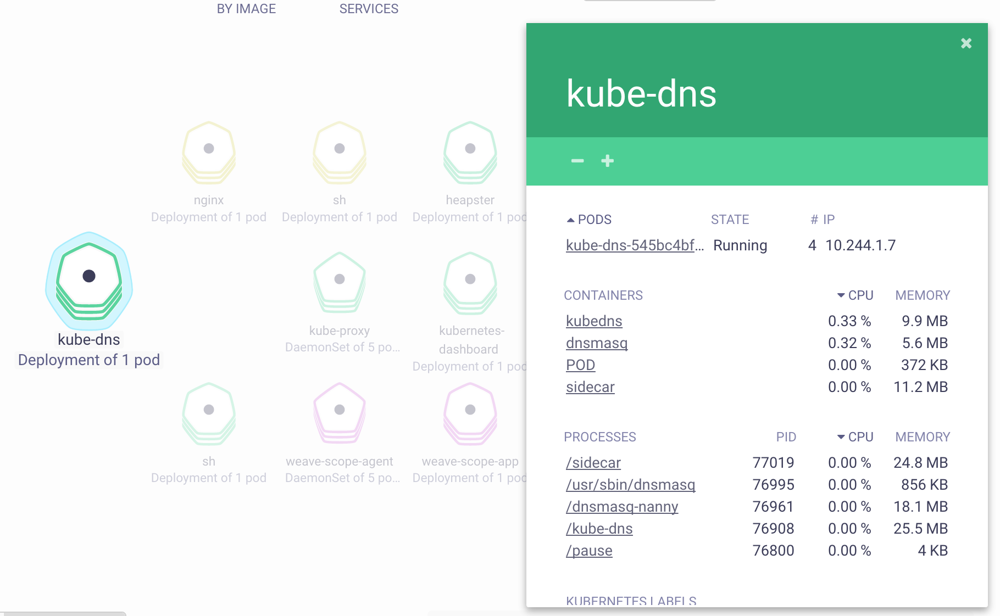

# 排错工具

本章主要介绍在 Kubernetes 排错中常用的工具。

## 必备工具

* kubectl：用于查看 Kubernetes 集群状态
* journalctl：用于查看 Kubernetes 组件日志
* iptables：用于排查 Service 是否工作
* tcpdump：用于排查容器网络问题

## sysdig

sysdig 是一个容器排错工具，提供了开源和商业版本。对于常规排错来说，使用开源版本即可。

除了 sysdig，还可以使用其他两个辅助工具

* csysdig：与 sysdig 一起自动安装，提供了一个命令行界面


* [sysdig-inspect](https://github.com/draios/sysdig-inspect)：为 sysdig 保存的跟踪文件（如 `sudo sysdig -w filename.scap`）提供了一个图形界面（非实时）

### 安装

```sh
# on Linux
curl -s https://s3.amazonaws.com/download.draios.com/stable/install-sysdig | sudo bash

# on MacOS
brew install sysdig
```

### 示例

```sh
# Refer https://www.sysdig.org/wiki/sysdig-examples/.
# View the top network connections for a single container
sysdig -pc -c topconns

# Show the network data exchanged with the host 192.168.0.1
sysdig -s2000 -A -c echo_fds fd.cip=192.168.0.1
 
# List all the incoming connections that are not served by apache.
sysdig -p"%proc.name %fd.name" "evt.type=accept and proc.name!=httpd"

# View the CPU/Network/IO usage of the processes running inside the container.
sysdig -pc -c topprocs_cpu container.id=2e854c4525b8
sysdig -pc -c topprocs_net container.id=2e854c4525b8
sysdig -pc -c topfiles_bytes container.id=2e854c4525b8

# See the files where apache spends the most time doing I/O
sysdig -c topfiles_time proc.name=httpd

# Show all the interactive commands executed inside a given container.
sysdig -pc -c spy_users 

# Show every time a file is opened under /etc.
sysdig evt.type=open and fd.name 
```

## Weave Scope

Weave Scope 是另外一款可视化容器监控和排错工具。与 sysdig 相比，它没有强大的命令行工具，但提供了一个简单易用的交互界面，自动描绘了整个集群的拓扑，并可以通过插件扩展其功能。从其官网的介绍来看，其提供的功能包括

- [交互式拓扑界面](https://www.weave.works/docs/scope/latest/features/#topology-mapping)
- [图形模式和表格模式](https://www.weave.works/docs/scope/latest/features/#mode)
- [过滤功能](https://www.weave.works/docs/scope/latest/features/#flexible-filtering)
- [搜索功能](https://www.weave.works/docs/scope/latest/features/#powerful-search)
- [实时度量](https://www.weave.works/docs/scope/latest/features/#real-time-app-and-container-metrics)
- [容器排错](https://www.weave.works/docs/scope/latest/features/#interact-with-and-manage-containers)
- [插件扩展](https://www.weave.works/docs/scope/latest/features/#custom-plugins)

Weave Scope 由 [App 和 Probe 两部分](https://www.weave.works/docs/scope/latest/how-it-works)组成，它们

- Probe 负责收集容器和宿主的信息，并发送给 App
- App 负责处理这些信息，并生成相应的报告，并以交互界面的形式展示

```sh
                    +--Docker host----------+      +--Docker host----------+
.---------------.   |  +--Container------+  |      |  +--Container------+  |
| Browser       |   |  |                 |  |      |  |                 |  |
|---------------|   |  |  +-----------+  |  |      |  |  +-----------+  |  |
|               |----->|  | scope-app |<-----.    .----->| scope-app |  |  |
|               |   |  |  +-----------+  |  | \  / |  |  +-----------+  |  |
|               |   |  |        ^        |  |  \/  |  |        ^        |  |
'---------------'   |  |        |        |  |  /\  |  |        |        |  |
                    |  | +-------------+ |  | /  \ |  | +-------------+ |  |
                    |  | | scope-probe |-----'    '-----| scope-probe | |  |
                    |  | +-------------+ |  |      |  | +-------------+ |  |
                    |  |                 |  |      |  |                 |  |
                    |  +-----------------+  |      |  +-----------------+  |
                    +-----------------------+      +-----------------------+
```

### 安装

```sh
kubectl apply -f "https://cloud.weave.works/k8s/scope.yaml?k8s-version=$(kubectl version | base64 | tr -d '\n')&k8s-service-type=LoadBalancer"
```

### 查看界面

安装完成后，可以通过 weave-scope-app 来访问交互界面

```sh
kubectl -n weave get service weave-scope-app
kubectl -n weave port-forward service/weave-scope-app :80
```



点击 Pod，还可以查看该 Pod 所有容器的实时状态和度量数据：



### 已知问题

在 Ubuntu 内核 4.4.0 上面开启 `--probe.ebpf.connections` 时（默认开启），Node 有可能会因为[内核问题而不停重启](https://github.com/weaveworks/scope/issues/3131)：

```sh
[ 263.736006] CPU: 0 PID: 6309 Comm: scope Not tainted 4.4.0-119-generic #143-Ubuntu
[ 263.736006] Hardware name: Microsoft Corporation Virtual Machine/Virtual Machine, BIOS 090007 06/02/2017
[ 263.736006] task: ffff88011cef5400 ti: ffff88000a0e4000 task.ti: ffff88000a0e4000
[ 263.736006] RIP: 0010:[] [] bpf_map_lookup_elem+0x6/0x20
[ 263.736006] RSP: 0018:ffff88000a0e7a70 EFLAGS: 00010082
[ 263.736006] RAX: ffffffff8117cd70 RBX: ffffc90000762068 RCX: 0000000000000000
[ 263.736006] RDX: 0000000000000000 RSI: ffff88000a0e7cd8 RDI: 000000001cdee380
[ 263.736006] RBP: ffff88000a0e7cf8 R08: 0000000005080021 R09: 0000000000000000
[ 263.736006] R10: 0000000000000020 R11: ffff880159e1c700 R12: 0000000000000000
[ 263.736006] R13: ffff88011cfaf400 R14: ffff88000a0e7e38 R15: ffff88000a0f8800
[ 263.736006] FS: 00007f5b0cd79700(0000) GS:ffff88015b600000(0000) knlGS:0000000000000000
[ 263.736006] CS: 0010 DS: 0000 ES: 0000 CR0: 0000000080050033
[ 263.736006] CR2: 000000001cdee3a8 CR3: 000000011ce04000 CR4: 0000000000040670
[ 263.736006] Stack:
[ 263.736006] ffff88000a0e7cf8 ffffffff81177411 0000000000000000 00001887000018a5
[ 263.736006] 000000001cdee380 ffff88000a0e7cd8 0000000000000000 0000000000000000
[ 263.736006] 0000000005080021 ffff88000a0e7e38 0000000000000000 0000000000000046
[ 263.736006] Call Trace:
[ 263.736006] [] ? __bpf_prog_run+0x7a1/0x1360
[ 263.736006] [] ? update_curr+0x79/0x170
[ 263.736006] [] ? update_cfs_shares+0xbc/0x100
[ 263.736006] [] ? update_curr+0x79/0x170
[ 263.736006] [] ? dput+0xb8/0x230
[ 263.736006] [] ? follow_managed+0x265/0x300
[ 263.736006] [] ? kmem_cache_alloc_trace+0x1d4/0x1f0
[ 263.736006] [] ? seq_open+0x5a/0xa0
[ 263.736006] [] ? probes_open+0x33/0x100
[ 263.736006] [] ? dput+0x34/0x230
[ 263.736006] [] ? mntput+0x24/0x40
[ 263.736006] [] trace_call_bpf+0x37/0x50
[ 263.736006] [] kretprobe_perf_func+0x3d/0x250
[ 263.736006] [] ? pre_handler_kretprobe+0x135/0x1b0
[ 263.736006] [] kretprobe_dispatcher+0x3d/0x60
[ 263.736006] [] ? do_sys_open+0x1b2/0x2a0
[ 263.736006] [] ? kretprobe_trampoline_holder+0x9/0x9
[ 263.736006] [] trampoline_handler+0x133/0x210
[ 263.736006] [] ? do_sys_open+0x1b2/0x2a0
[ 263.736006] [] kretprobe_trampoline+0x25/0x57
[ 263.736006] [] ? kretprobe_trampoline_holder+0x9/0x9
[ 263.736006] [] SyS_openat+0x14/0x20
[ 263.736006] [] entry_SYSCALL_64_fastpath+0x1c/0xbb
```

解决方法有两种

- 禁止 eBPF 探测，如 `--probe.ebpf.connections=false`
- 升级内核，如升级到 4.13.0

## 参考文档

- [Overview of kubectl](https://kubernetes.io/docs/reference/kubectl/overview/)
- [Monitoring Kuberietes with sysdig](https://sysdig.com/blog/kubernetes-service-discovery-docker/)